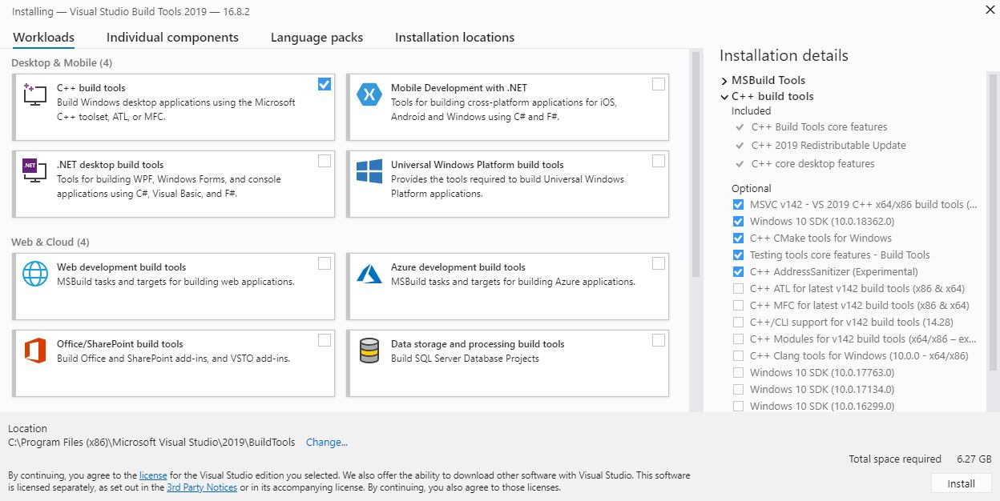

# Advanced installation

This section describes any additional installation instructions for the 5 EULP packages.

## [EULP-data-analysis](https://github.com/NREL/EULP-data-analysis)
Windows users will need to download and install [Visual Studio Build Tools 2019](https://visualstudio.microsoft.com/downloads/). The direct link for the download is [here](https://visualstudio.microsoft.com/thank-you-downloading-visual-studio/?sku=BuildTools&rel=16). If you do not have "NREL Run as Administrator" available on your machine, you will need to contact IT for support.

During installation, be sure that the optional "C++ CMake tools for Windows" box is checked. See the image below for help.

## [EULP-uncertainty-quantification](https://github.com/NREL/EULP-uncertainty-quantification)
No additional installation instructions at this time.

## [EULP-occupancy-modeling](https://github.com/NREL/EULP-occupancy-modeling)
No additional installation instructions at this time.

## [EULP-data-cleaning](https://github.com/NREL/EULP-data-cleaning)
No additional installation instructions at this time.

## [EULP-calibration-and-validation](https://github.com/NREL/EULP-calibration-and-validation)
No additional installation instructions at this time.