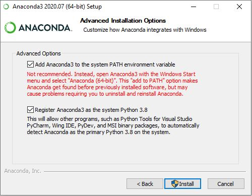

Installation
------------
Download and install the latest version of [Anaconda3](https://www.anaconda.com/products/individual). Be sure to check the optional "Add Anaconda3 to the system PATH environment variable" box during installation:



Check your installed versiom of `conda` using:
```
$ conda --version
```

Create a new conda environment with **python 3.8** or above:
```
$ conda create -n <name-of-repository> python=3.8 pip
$ conda activate <name-of-repository>
```

For example, if you're using the [EULP-data-analysis](https://github.com/NREL/EULP-data-analysis) repository:
```
$ conda create -n eulpda python=3.8 pip
$ conda activate eulpda
```

(If you're using a version of `conda` older than 4.4, you may need to instead use `source activate <name-of-repository>`.)

Make sure you are using the latest version of `pip`:
```
$ pip install --upgrade pip
```

Add or update any dependency packages to the `install_requires` list in `setup.py` (file located at the top level of each repository). For example, maybe for the analysis `pandas` is needed for dataframe manipulation and `matplotlib` is needed for plotting. The following code block shows how to add these packages to `setup.py`.
```
install_requires=[
    'pandas',
    'matplotlib'
],
```

Install the environment needed for this repository:
```
$ pip install -e .[dev]
```

The previous command will install all the dependency packages that are called out in the `setup.py` file. Some of these packages are required for running things like tests and coverage, while others are required to run classes and methods found in the source code files. 